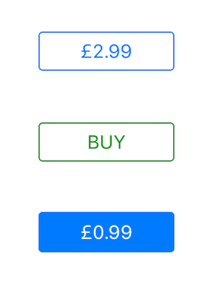

# JCOStoreButton

Jaaco Store Button is a `UIButton` derived class that you can use approximate the AppStore Buy button:

## Installation
To install the button, simply copy the source `JCOStoreButton.h` and `JCOStoreButton.m` from the `src/JCOStoreButton/` folder into your project.

## Usage
To use the button, you can drop a `UIButton` on your storyboard, and change the parent class to be of `JCOStoreButton` or create an instance manually in your controller and add it to the view.

Set the `priceText` and `buyText` properties of the control for rendering the data you would like; and then wire up the `TouchUpInside` event to work with the control. 

You can use the `buttonState` property to determine the state of the control at the time of the touch, and you can use the `cancel` method to restore the control back to the default state.

See `src/example` for details.

## License
The MIT License (MIT)

Copyright (c) 2015 Paul Jackson

Permission is hereby granted, free of charge, to any person obtaining a copy
of this software and associated documentation files (the "Software"), to deal
in the Software without restriction, including without limitation the rights
to use, copy, modify, merge, publish, distribute, sublicense, and/or sell
copies of the Software, and to permit persons to whom the Software is
furnished to do so, subject to the following conditions:

The above copyright notice and this permission notice shall be included in all
copies or substantial portions of the Software.

THE SOFTWARE IS PROVIDED "AS IS", WITHOUT WARRANTY OF ANY KIND, EXPRESS OR
IMPLIED, INCLUDING BUT NOT LIMITED TO THE WARRANTIES OF MERCHANTABILITY,
FITNESS FOR A PARTICULAR PURPOSE AND NONINFRINGEMENT. IN NO EVENT SHALL THE
AUTHORS OR COPYRIGHT HOLDERS BE LIABLE FOR ANY CLAIM, DAMAGES OR OTHER
LIABILITY, WHETHER IN AN ACTION OF CONTRACT, TORT OR OTHERWISE, ARISING FROM,
OUT OF OR IN CONNECTION WITH THE SOFTWARE OR THE USE OR OTHER DEALINGS IN THE
SOFTWARE.